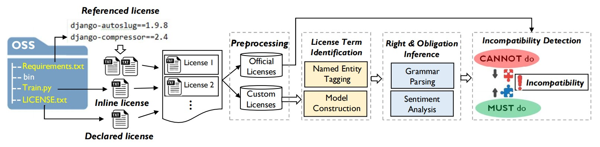
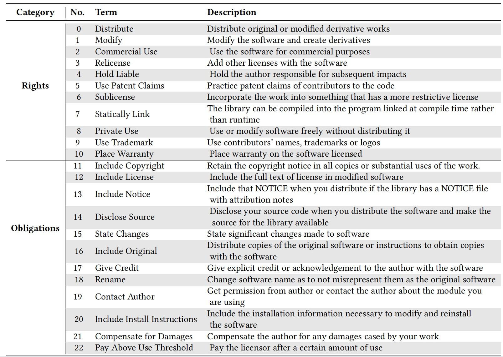

# LiDetector

**LiDetector** , a hybrid method that automatically understands license texts and infers rights and obligations to detect license incompatibility in open-source software.   
For an open-source project as input, where licenses may appear in three forms: referenced, declared, and inline, the license texts are first extracted from the two forms for further incompatibility analysis. With  such a license set, the main components of LiDetector include:   
**(1) Preprocessing**, which filters out official licenses and feeds custom ones into the probabilistic model for automatic understandings of license texts.  
**(2) License term identification**, which aims to identify license terms relevant to rights and obligations;   
**(3) Right and obligation inference**, which infers the stated condition of software use defined by license terms;   
**(4) Incompatibility detection**,  which automatically analyzes incompatibility between multiple licenses within one project based on the regulations inferred from each license. 

	

# Code

## How to start
Run the python scripts according the order below:  
`extract_licenseRelated_fromPros.py`  
`collect_files_for_model.py`  
`model\PreprocessData\cleanData_intoTestDir.py`  
`model\LocateTerms\ner_predict.py`  
`model\DetermAtti\get_treeAtti.py`  
`prepare_condInfo.py`  
`check_incompatibility.py`  

## Dirs and files

## Other needs

# Knowledge

## License terms and descriptions   
In this paper, a license term refers to a formal and unified description of a certain right or obligation, (e.g., commercial use). In our License term identification phase, we aim to identify license terms. 23 license terms and their descriptions are showed below:  

	

## Keyword  patterns for Regular Matching
In the evaluation stage on the License Term Identification phase, this paper implements Regular Matching as one of our baselines. We predefined a set of keyword patterns to guide license term identification. 72 patterns were found for 23 license terms, which can be downloaded by the following link.  
https://drive.google.com/uc?id=1FpA6_n7__nb5Dm64FRuA9fzDP6bgpSEe&export=download

## Representative sentences for Semantic Similarity
In the evaluation stage on the License Term Identification phase, this paper implements Semantic Similarity as one of our baselines. We manually analyze license sentences and collect a set of representative sentences that are relevant to each license term, 51 representative sentences for 23 license terms were found, which can be downloaded by the following link.  
https://drive.google.com/uc?id=1YCrKGC5QIbu7KB17DnXCSCr5xM1Cf2UL&export=download

# Dataset

## Term entity tagging for the Term Identification phase
We tagged license term entities on 400 licenses for training and testing the sequence labeling model in the Term Identification phase. These data can be downloaded by the following link.  
https://drive.google.com/uc?id=1V8IiM2XuQ9oQFXJf1OYmmQdL75eu506J&export=download

## Testing dataset for overall License Comprehension
In the evaluation stage on the License Term Identification phase, Right and obligation inference phase, and overall License Comprehension (i.e., the overall performance of the previous two phases), this paper employed 80 licenses as the testing dataset, after randomly splitting 400 samples aforementioned into the training and testing datasets by 4:1. These licenses are equipped with their attitudes towards 23 terms, which can be downloaded by the following link.  
https://drive.google.com/uc?id=1TWeDJJeUsD8AY0sQgA7SYSfjEcHD-D2z&export=download

## Dataset for official licenses
In this paper, *official licenses* denote licenses from the Software Package Data Exchange (SPDX). We collect and annotate these licenses for their rights, obligations and conditions.  

## Dataset for Empirical Study
We crawled 1,846 Github projects for motivating study and Empirical Study, in which each OSS project has high star numbers. They were extracted by their inline licenses,  declared licenses, referenced licenses, and identified by ID from 1 to 1,846, which can be downloaded by the following link.  
https://drive.google.com/uc?id=1TQS_UmX0wpTvq5dj5b6CdGc20v9qd4JP&export=download

## Test dataset for  Incompatibility Detection phase
We randomly selected 200 projects from the above 1,846 GitHub project and constructed a ground-truth dataset by manual analysis, on whether this project has a license incompatibility situation. The testing list can be downloaded by the following link.  
https://drive.google.com/uc?id=1e91pG_EGvqUxtNiLbeKPj-WxRTByOzrp&export=download

